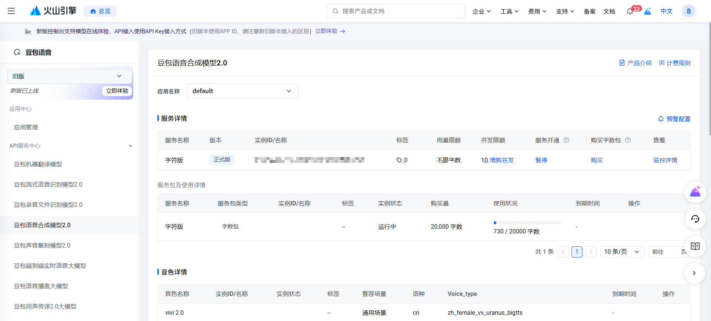

# kai-sound-tts

这是我做的一套 `网页 + PHP + Python + MQTT + ESP32` 的 TTS 播报方案。

现在这版主链路已经跑通了，流程是：

```text
网页输入文本
-> PHP 负责编排
-> Python 对接火山引擎 TTS
-> MQTT 下发命令
-> ESP32 拉取 HTTP MP3 流
-> I2S 功放播放
```

## 这版现在能做什么

- 网页输入任意文本并发送播报
- PHP 自动断句分段
- PHP 提前把每一段 TTS 先准备好
- ESP32 按顺序一段一段播放
- ESP32 侧加了 `32KB` 缓冲，长文本比之前稳很多

这版我主要拿它来做：

- 单条播报
- 长文本顺序播报
- 服务端控制 ESP32 播放

## 目录

```text
web_sound/
├─ arduino/sound/sound.ino     # ESP32 固件
├─ image/                      # 硬件图片
├─ php-server/                 # PHP 服务
│  ├─ public/                  # 页面和正式 API 入口
│  │  └─ api/                  # command / tts / tts-status
│  ├─ config.php               # MQTT / Python TTS 配置
│  └─ tts_request_handler.php  # 分段、预生成、顺序下发
├─ python-vol/                 # 火山引擎 TTS Python 服务
├─ README.md
└─ 踩坑说明.md
```

## 我现在的部署方式

### PHP

我这边暂时按宝塔站点来放，最省事：

- 新建一个站点
- 站点目录直接指向 `php-server/public/`
- 把 `php-server/` 整个目录传上去

我现在实际用的接口入口也都在这套 `public/api/` 下面，没有再保留根目录那套兼容 API。

### Python

Python 这部分单独跑在服务器上，对应目录是：

- [python-vol/README.md](python-vol/README.md)

具体怎么装依赖、怎么配、怎么启动，我都写在这份 README 里了。

### Mosquitto

MQTT broker 我现在用的是 Mosquitto。

对应配置在：

- [php-server/config.php](php-server/config.php)

常见启动方式例如：

```bash
mosquitto -p 1883 -d
```

如果服务器是 systemd 管理，也可以：

```bash
systemctl start mosquitto
systemctl enable mosquitto
```

## 启动顺序

我现在一般按这个顺序启动：

1. 先把 Mosquitto 起起来
2. 再启动 `python-vol`
3. 让宝塔站点把 PHP 页面和接口跑起来
4. ESP32 上电联网
5. 打开网页发播报

## 部署前我会先改的配置

这几个地方现在仓库里放的是占位值，真正部署前我都会先按自己的环境替换掉。

### ESP32

文件：

- [arduino/sound/sound.ino](arduino/sound/sound.ino)

需要改：

- `WIFI_SSID`
- `WIFI_PASSWORD`
- `MQTT_BROKER`
- `MQTT_USERNAME`
- `MQTT_PASSWORD`
- `DEVICE_ID`

### PHP

文件：

- [php-server/config.php](php-server/config.php)

需要改：

- `mqtt.host`
- `mqtt.port`
- `mqtt.username`
- `mqtt.password`
- `python_tts.prepare_url`

### Python

文件：

- [python-vol/tts_bridge_config.py](python-vol/tts_bridge_config.py)

需要改：

- `VOLCENGINE_API_KEY`
- `VOLCENGINE_RESOURCE_ID`
- `VOLCENGINE_SPEAKER`
- `TTS_PUBLIC_BASE_URL`

## PHP 这一层现在负责什么

我现在把编排逻辑主要放在 PHP：

- 接收网页请求
- 自动断句
- 分段
- 预生成每一段 TTS
- 按顺序通过 MQTT 发给 ESP32

PHP 默认会通过本机地址去调 Python TTS 服务，例如：

```php
'python_tts' => [
    'prepare_url' => 'http://127.0.0.1:9100/api/tts',
    'timeout' => 20,
],
```

所以我现在默认的部署口径就是：

- PHP 和 Python 放在同一台服务器
- PHP 负责“编排”
- Python 负责“生成可播放流地址”

## ESP32 这一层现在负责什么

固件在：

- [arduino/sound/sound.ino](arduino/sound/sound.ino)

ESP32 现在主要做这几件事：

- 订阅 MQTT 命令
- 收到 `cmd=tts` 之后去拉 HTTP 音频流
- 用 `AudioFileSourceBuffer` 做本地缓冲
- 通过 I2S 把声音送到功放和喇叭

我现在这版固件里比较关键的参数是：

- `Audio buffer: 32768 bytes`
- `MQTT keepAlive: 15`
- `MQTT bufferSize: 2048`

## 长文本现在怎么处理

长文本我现在不再走“一整段一次性硬播”，而是：

1. 先按 `。！？；` 和换行断句
2. 太长的句子再按 `，、：` 继续切
3. 再长就按长度兜底
4. PHP 先把所有分段的 TTS 都准备好
5. ESP32 播完一段后，再发下一段

我最后这样做，主要是因为整段长流虽然更连贯，但太容易被网络抖动打断。现在这版是用一点点段间停顿，换整体稳定。

## 火山引擎

这版我直接用火山引擎来做 TTS。



大概就是：

- 我先建一个火山引擎账号
- 默认会有一部分测试额度
- 当前这版就是基于这部分额度在跑

## 我这次用到的硬件

下面这些就是我这次实际在用、也比较适合直接买来测试的东西：


我自己比较推荐的购买方向：

- ESP32 开发板
- MAX98357A I2S 功放模块
- 小喇叭
- 杜邦线

## 现在还剩下的边界

### 1. 分段之间还是会有一点空档

虽然现在已经做了预生成，但本质上还是一段一个流，所以不是完全无缝。

### 2. 播放稳定性还是吃 WiFi 环境

如果 ESP32 到路由器这一层本身不稳，播放体验还是会受影响。

### 3. 这版不主打复杂插播

我现在更看重的是顺序播报稳定，而不是强抢占式插播。

## 相关文档

- [python-vol/README.md](python-vol/README.md)
- [踩坑说明.md](踩坑说明.md)
