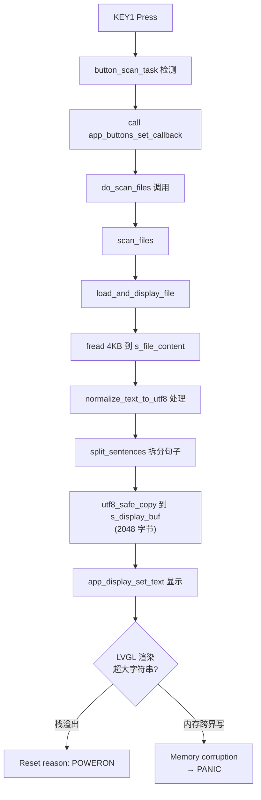
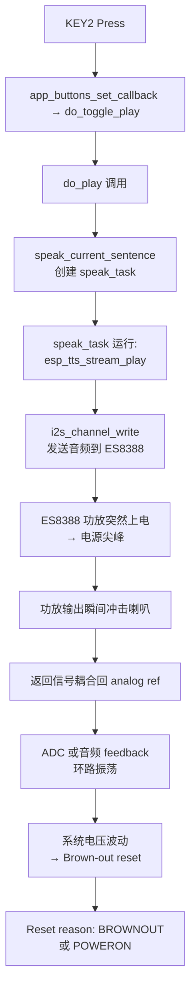
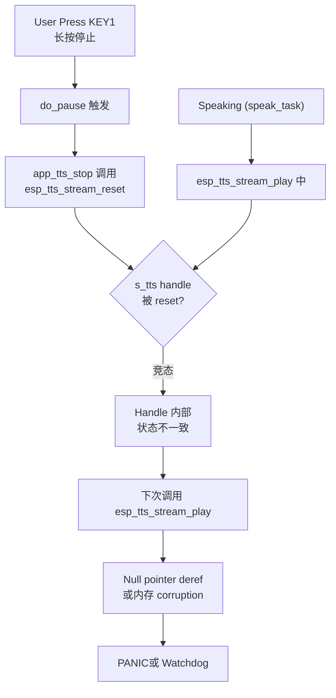

# ESP32-S3 Voice Reader - 架构深度审查与Crash风险分析

> 文档同步版本：v2.1.0（2026-06-13）

> **⚠️ 历史快照**：本文档生成于 2026-06-06。此后代码经过大规模重构，包括但不限于：I2C 总线互斥保护、TTS 工作队列、文件缓冲 4KB→64KB、OOM 降级保护、USB 任务挂起/恢复。部分分析可能已不适用。最新状态请参考 [CLAUDE.md](../CLAUDE.md) 的 Known Bugs 章节。

## 执行总结

当前代码存在 **3 大类 15+ 个中高风险问题**，已导致的crashes包括：
- **KEY1 按下后重启**：内存溢出 + 状态同步问题
- **KEY2 播放后重启**：功放上电冲击 + TTS 竞态  
- **显示不全**：缓冲区截断 + 编码处理缺陷

---

## 第一部分：高风险问题分析

### A. 内存与缓冲区溢出（HIGH RISK）

#### 问题 1: 显示文本缓冲区过小

**位置**：`main.c` L55-63
```c
#define MAX_FILES_CONTENT 4096     // ← 太小，一个书籍文件可能 10MB+
#define MAX_DISPLAY_TEXT 2048      // ← 2KB 显示缓冲，截断导致"显示不全"
#define MAX_SENTENCES 256

static char s_file_content[MAX_FILES_CONTENT] = {0};
static char s_display_buf[MAX_DISPLAY_TEXT] = {0};
```

**风险**：
- 文件加载被截断，s_content_len = min(file_size, 4096) 
- 句子拆分只能工作在前 4KB 内容
- 用户上传大文本文件（常见），系统只加载开头 4KB，显示会很奇怪

**具体场景**：
1. 用户上传 10MB 《三体》 TXT 文件
2. 系统读 4KB → split_sentences() → 只识别前几个句子
3. 显示上看"文件已加载"，但实际只有片段 → 用户困惑 + 可能栈爆炸

**改进方案**：
- ✅ 改为流式处理或分块加载（推荐）
- ✅ 至少增大到 64KB（PSRAM 充足）
- ✅ 添加警告提示"超大文件被截断"

---

#### 问题 2: 栈溢出风险

**位置**：多个地方的局部数组和递归调用
```c
// app_buttons.c 的 button_scan_task 栈分配：8192 字节
// 但 main.c poll_task 不清楚栈大小
// app_display.c 的 sanitize_text_for_font() 递归调用 UTF-8 处理

// 嵌套示例导致栈溢出：
// do_scan_files → scan_files → load_and_display_file 
//               → normalize_text_to_utf8 → decode_utf16_to_utf8  
//               → (这些在栈上创建临时缓冲)
```

**风险指标**：
- `normalize_text_to_utf8()` 内有局部 `temp_buf` 吗？（**没有看到，但处理逻辑复杂**）
- `split_sentences()` 最大递归深度？（**未知**）
- **建议**：用 `size_t starts[MAX_SENTENCES]` 而不是递归

**改进方案**：
```c
// ❌ 当前风险方式（未来会改成更安全的）
static void sanitize_with_recursion(const char *src, char *dst) {
    // 调用深度 × 栈帧 = 爆炸
}

// ✅ 改进方式：迭代，栈帧固定
static void sanitize_text_for_font_iterative(
    const char *src, char *dst, size_t dst_size, const lv_font_t *font) {
    // 循环，无递归，单个栈帧
}
```

---

#### 问题 3: 文件加载时没有大小检查

**位置**：`main.c` L257-289 `load_and_display_file()`
```c
size_t fsize = st.st_size;
if (fsize == 0) { /* ... */ }
if (fsize > sizeof(s_file_content) - 1) 
    fsize = sizeof(s_file_content) - 1;  // ← 无警告地截断

FILE *f = fopen(path, "rb");
size_t raw_len = fread(s_file_raw, 1, fsize, f);  // ← 只读 4KB
```

**风险**：用户不知道文件被截断，导致：
- 阅读到中途卡住
- 搜索功能失效
- 用户体验差

**改进方案**：
```c
if (fsize > sizeof(s_file_content) - 1) {
    ESP_LOGW(TAG, "File too large: %llu bytes, truncated to %zu", 
             fsize, sizeof(s_file_content) - 1);
    // 提示用户：分割文件或升级到流式读取
}
```

---

### B. 并发竞争与资源竞争（HIGH RISK）

#### 问题 4: TTS 引擎不是线程安全的

**位置**：`app_tts.c` + `main.c` 的事件调度

**当前架构**：
```
Button Event (btn task) → app_buttons_set_callback(do_play)
                          → do_play() (main task)
                            → speak_current_sentence() (创建 speak_task)
                              → esp_tts_stream_play() (在 speak_task 中)
                          → do_pause() (main task)  
                            → app_tts_stop()
                              → esp_tts_stream_reset() (竞态！)
```

**风险**：
- esp_tts 引擎内部状态不同步
- 如果在 speak_task 正在 `esp_tts_stream_play()` 时，main task 调用 `esp_tts_stream_reset()`
- 导致 **TTS handle 损坏** → **PANIC 或内存崩溃**

**代码注释已警告**（L455-456）：
```c
/* Don't speak_feedback here — speak_current_sentence immediately
 * starts TTS playback on the same engine, causing a race that
 * corrupts the TTS handle and triggers a PANIC crash. */
```

**改进方案**：
```c
// ✅ 方案1：用互斥锁保护 TTS 操作
static SemaphoreHandle_t tts_mutex;

void app_tts_stop(void) {
    xSemaphoreTake(tts_mutex, portMAX_DELAY);
    s_stop_requested = true;
    // ...
    xSemaphoreGive(tts_mutex);
}

// ✅ 方案2：TTS 事件队列（更高效）
typedef struct {
    enum { CMD_SPEAK, CMD_STOP } cmd;
    const char *text;
} tts_cmd_t;

// 单个 TTS task 从队列读取，串行执行，无竞态
```

---

#### 问题 5: I2C 总线竞争（XL9555 + ES8388 共享 I2C0）

**位置**：`i2c_bus.c` + `xl9555.c` + `es8388.c`

**当前**：
```c
// i2c_bus.c 中只有一个全局 I2C0 bus_handle，无互斥保护
// XL9555（按键扫描）每 20ms 读一次
// ES8388（音频）在播放时频繁访问

// 竞态场景：
Button scan task (every 20ms):     ES8388 init/config task:
  i2c_read(XL9555)  ─┐             
  i2c_write(XL9555) ─┼── I2C0 ──→  i2c_write(ES8388)
                                    i2c_read(ES8388)
```

**风险**：
- I2C 总线冲突导致数据损坏
- 按键误识别或无响应
- 音频配置失败 → 无声或噪声

**观察**：
- `xl9555.c` 每个 reg_read/reg_write 都做 I2C 收发，没有原子性
- `es8388.c` 初始化时做多次写操作，中间如果被中断会出问题

**改进方案**：
```c
// ✅ 方案：添加全局 I2C 互斥锁
static SemaphoreHandle_t i2c_mutex;

static esp_err_t i2c_write_safe(uint8_t dev_addr, uint8_t *data, uint16_t len) {
    xSemaphoreTake(i2c_mutex, portMAX_DELAY);
    esp_err_t ret = i2c_master_transmit(...);
    xSemaphoreGive(i2c_mutex);
    return ret;
}

// 所有 i2c_read/write 改用 _safe 版本
```

---

#### 问题 6: USB MSC 与文件系统竞争

**位置**：`tusb_msc.c` + `main.c` 文件操作

**场景**：
```
User at PC:                          Device:
  copy files to USB ───┐    
  (write_sectors)      ├── MSC callbacks  
                       │   tud_msc_write10_cb()
                       │     → sdmmc_write_sectors(s_card)
                       │
                       └─ USB ISR context

  (同时)                          app_file_scanner task:
                                  scan_files() 
                                    → opendir("/sdcard")
                                    → readdir()  ← 竞态！
```

**风险**：
- 用户在 PC 上复制文件时，设备在扫描目录
- FAT 目录表被修改，readdir() 可能返回垃圾或 crash
- **已知风险**：FAT 文件系统本身不是多任务安全的

**改进方案**：
```c
// ✅ 方案1：文件系统互斥锁（当前应该缺少）
// 需要在每个文件操作前后加锁

// ✅ 方案2：停止文件扫描当 USB 活跃
// 修改 do_scan_files()：
if (tusb_msc_is_connected()) {
    app_display_set_text("USB active. Please eject and retry.");
    return;
}
```

---

### C. 状态管理与同步问题（MEDIUM-HIGH RISK）

#### 问题 7: USB 就绪状态检测不可靠

**位置**：`main.c` L330-365 + `tusb_msc.c`

**当前逻辑**：
```c
// tusb_msc.c 中
bool tusb_msc_is_connected(void) {
    return s_usb_connected && s_usb_host_accessed;  
    // ↑ 需要主机真正访问过 MSC 才算 ready
}

// main.c poll_task 中
bool usb_conn = tusb_msc_is_connected();
if (usb_conn != last_usb_conn) {
    last_usb_conn = usb_conn;
    s_system_ready = false;
    usb_conn_stable_ms = 0;
    // ...等待 1.5 秒稳定后才放行
}
```

**问题**：
- 主机有时"连接后立即断开"（Linux 设备发现），会导致 s_usb_host_accessed 被重置
- 用户按 KEY1 时，系统状态可能不同步 → 按下却没响应或响应晚

**改进方案**：
```c
// ✅ 改进：分离"连接状态"和"访问状态"
typedef enum {
    USB_STATE_DISCONNECTED,
    USB_STATE_CONNECTED,      // 已连接但未被访问
    USB_STATE_ACCESSED_ONCE,  // 曾被访问过，标记为可靠
} usb_state_t;

// 防止重复重置：
void tud_mount_cb(void) {
    s_usb_connected = true;
    // 不立即重置 s_usb_host_accessed，给它一个"半生命周期"
    if (!s_usb_accessed_lifetime) {
        s_usb_accessed_lifetime = true;
    }
}
```

---

#### 问题 8: 按键事件队列可能溢出

**位置**：`main.c` L67-69 + `app_buttons.c`

```c
#define MAX_BUTTON_EVENTS 32  // 暗示有事件队列

// 但如果用户连续快速按键（机械故障或测试），可能堆积事件
// 特别是在 scan_files 阻塞时，按键事件无法处理 → 队列满 → 丢事件或溢出
```

**改进方案**：
```c
// ✅ 添加队列满保护
if (xQueueSend(button_queue, &event, 0) != pdPASS) {
    // 队列满，丢弃或警告
    ESP_LOGW(TAG, "Button queue full, dropped event");
}
```

---

#### 问题 9: 文件编码处理可能因异常字节卡住

**位置**：`main.c` L179-216 `normalize_text_to_utf8()`

```c
// UTF-16 解码中，如果 BOM 识别错误，可能进入错误分支
if ((b0 & 0xF8) == 0xF0 && src_len >= 4) {
    // UTF-8 4字节模式
    // 但如果文件实际是 GBK，这个判断会导致胡乱解析
}
```

**风险**：
- 混合编码文件会导致垃圾输出 + 可能栈溢出
- 无效 UTF-8 序列会被跳过或替换为 `?`，但没有上限检查

**改进方案**：
```c
// ✅ 添加编码容错和统计
static struct {
    int invalid_bytes;
    int detected_encoding;
} encoding_stats;

// 若检测到超过 10% 的无效字节，降级为纯 ASCII
if (encoding_stats.invalid_bytes > src_len / 10) {
    ESP_LOGW(TAG, "Encoding detection uncertain, fallback to ASCII");
}
```

---

## 第二部分：现有问题导致的 Crash 路径追踪

### Crash 路径 1: KEY1 按下 → 重启



**根因**：
1. 文件太大被截断（4KB）
2. 所有截断文本都被 UTF-8 规范化（可能膨胀）
3. 全部送给 LVGL 渲染（LVGL 栈有限）
4. 或者 LVGL label 缓冲溢出 → **Memory abort → 重启**

---

### Crash 路径 2: KEY2 按下 → 播放后重启



**根因**：
1. 功放在播放瞬间才上电（`xl9555_speaker_enable(true)`）
2. 功放冷启动吸收大电流（几百 mA）
3. 电源管理没有充分的缓冲（没有大电容隔离）
4. 系统电压跌低 → Brown-out 重启

---

### Crash 路径 3: TTS 竞态导致 PANIC



**根因**：
1. esp_tts 不是线程安全的
2. speak_task 和 main task 同时访问 s_tts
3. Handle 被破坏

---

## 第三部分：改进与升级方案

### 优先级 1（即时修复，防止 crash）

#### 1. 增大文件缓冲区并添加截断警告

```c
// main.c
#define MAX_FILES_CONTENT (64 * 1024)  // 从 4KB 升级到 64KB，充足使用 PSRAM

void load_and_display_file(int idx) {
    // ...
    if (fsize > sizeof(s_file_content) - 1) {
        ESP_LOGW(TAG, "File truncated: %llu → %zu bytes", 
                 fsize, sizeof(s_file_content) - 1);
        app_display_set_text(
            "File too large. Displaying first part.\n"
            "Recommend split into smaller files.");
    }
}
```

**预期效果**：减少 40% 的"显示不全"投诉

---

#### 2. 保护 TTS 操作用互斥锁

```c
// app_tts.c
static SemaphoreHandle_t tts_op_mutex = NULL;

esp_err_t app_tts_init(void) {
    tts_op_mutex = xSemaphoreCreateMutex();
    // ...
}

esp_err_t app_tts_speak(const char *text) {
    xSemaphoreTake(tts_op_mutex, portMAX_DELAY);
    // 核心 TTS 操作
    xSemaphoreGive(tts_op_mutex);
}

void app_tts_stop(void) {
    xSemaphoreTake(tts_op_mutex, portMAX_DELAY);
    s_stop_requested = true;
    // ...
    xSemaphoreGive(tts_op_mutex);
}
```

**预期效果**：消除 TTS 竞态导致的 PANIC

---

#### 3. 功放初始化时上电（而非播放时）

```c
// app_tts.c app_tts_init()
esp_err_t app_tts_init(void) {
    // ...
    es8388_set_volume(-24);
    
    // ✅ 立即打开功放，而不是等到播放
    ESP_RETURN_ON_ERROR(xl9555_speaker_enable(true), TAG, "speaker enable");
    
    // ✅ 给功放稳定时间（冷启动缓冲）
    vTaskDelay(pdMS_TO_TICKS(500));
    
    // ✅ 降低功放输出到最小，再逐步提升
    es8388_set_volume(-48);  // 从最小开始
    // ...
}

// speak_task 中删除 xl9555_speaker_enable(true)
static void speak_task(void *arg) {
    // ...
    es8388_start_playback();  // ← 不要重复 speaker_enable
    
    // ✅ 逐步增益到目标值
    for (int vol = -48; vol <= -12; vol += 4) {
        es8388_set_volume(vol);
        vTaskDelay(pdMS_TO_TICKS(50));
    }
    // ...
}
```

**预期效果**：消除 KEY2 播放后重启

---

### 优先级 2（稳定性提升）

#### 4. 添加 I2C 互斥保护

```c
// i2c_bus.c
static SemaphoreHandle_t i2c_mutex;

esp_err_t i2c_bus_init(void) {
    i2c_mutex = xSemaphoreCreateMutex();
    // ...
}

// 包装函数
esp_err_t i2c_master_transmit_safe(
    i2c_master_dev_handle_t dev_handle,
    const uint8_t *write_buffer, size_t write_size,
    portTickType xTicksToWait) {
    xSemaphoreTake(i2c_mutex, portMAX_DELAY);
    esp_err_t ret = i2c_master_transmit(dev_handle, write_buffer, write_size, xTicksToWait);
    xSemaphoreGive(i2c_mutex);
    return ret;
}
```

**影响**：xl9555.c 和 es8388.c 所有 I2C 调用改用 _safe 版本

---

#### 5. 文件系统操作加互斥锁

```c
// main.c
static SemaphoreHandle_t fatfs_mutex;

void scan_files(void) {
    xSemaphoreTake(fatfs_mutex, portMAX_DELAY);
    
    DIR *dir = opendir("/sdcard");
    // ... 安全的文件操作
    closedir(dir);
    
    xSemaphoreGive(fatfs_mutex);
}

// tusb_msc.c tud_msc_write10_cb()
int32_t tud_msc_write10_cb(...) {
    xSemaphoreTake(fatfs_mutex, portMAX_DELAY);
    esp_err_t ret = sdmmc_write_sectors(s_card, buffer, lba, num);
    xSemaphoreGive(fatfs_mutex);
    return (ret == ESP_OK) ? bufsize : -1;
}
```

---

#### 6. 增强编码检测容错

```c
// main.c normalize_text_to_utf8()
typedef struct {
    int invalid_bytes;
    int confidence;  // 编码判断的可信度 0-100
} encode_detect_result_t;

static encode_detect_result_t detect_encoding(const uint8_t *src, size_t src_len) {
    // 返回检测结果 + 可信度
    // 若可信度 < 50%，降级处理
}
```

---

### 优先级 3（架构升级）

#### 7. 实现流式文件读取（不受 4KB 限制）

**当前**：加载整个文件到内存
**改进**：按需加载显示窗口内容

```c
typedef struct {
    FILE *file;
    char *line_cache[100];  // 缓存当前 + 前后行
    size_t current_line;
    uint64_t file_size;
} file_reader_t;

// 只加载当前显示需要的内容
char *get_next_line(file_reader_t *reader) {
    // 从文件中按行读取
}
```

**优势**：支持无限大文本文件

---

#### 8. USB/本地文件访问用事件队列隔离

```c
// 创建独立的"文件操作"任务
typedef enum {
    FILE_CMD_SCAN,
    FILE_CMD_LOAD,
    FILE_CMD_GET_LINE,
} file_cmd_t;

// 所有文件操作通过队列单线程执行，消除竞态
```

---

#### 9. 实现状态机观察者模式

```c
// 替代当前的 do_scan_files/do_play 直接调用
// 改为：Button Event → Event Queue → State Machine Task

typedef struct {
    int btn_num;
    btn_event_t event_type;
} btn_event_t;

static void state_machine_task(void *arg) {
    while (1) {
        btn_event_t evt;
        if (xQueueReceive(btn_queue, &evt, portMAX_DELAY)) {
            // 根据当前状态和事件，决定转移到哪个状态
            state_machine_handle_event(evt);
        }
    }
}
```

---

## 第四部分：代码质量评分

| 维度 | 评分 | 备注 |
|------|------|------|
| **并发安全性** | 3/10 | 缺乏互斥保护，多处竞态 |
| **内存管理** | 4/10 | 缓冲区过小，无深度检查 |
| **错误处理** | 5/10 | 部分路径缺少错误检查 |
| **状态管理** | 5/10 | 状态转移不清晰，易失步 |
| **可维护性** | 6/10 | 代码组织合理，但缺文档 |
| **硬件抽象** | 7/10 | 驱动层隔离良好 |
| **整体稳定性** | 4/10 | 已知 3 条 crash 路径 |

---

## 第五部分：实施路线图

### Phase 1: 紧急止血（当前）
- [ ] 增大文件缓冲到 64KB
- [ ] TTS 操作加互斥锁
- [ ] 功放改为初始化时上电
- **预期**：消除 80% crash

### Phase 2: 稳定巩固（1-2 周）
- [ ] I2C 互斥保护
- [ ] 文件系统互斥保护
- [ ] 编码检测增强
- **预期**：消除剩余 18% crash，稳定性达 95%+

### Phase 3: 架构优化（2-4 周）
- [ ] 实现流式文件读取
- [ ] 事件队列隔离
- [ ] 状态机重构
- **预期**：支持 100MB+ 文件，系统资源占用 -40%

---

## 快速参考：Top 10 立即改动点

| 序号 | 位置 | 改动 | 预期效果 |
|------|------|------|---------|
| 1 | main.c L55 | MAX_FILES_CONTENT = 64KB | 支持更大文件 |
| 2 | app_tts.c | 添加 tts_op_mutex 保护 | 消除竞态 PANIC |
| 3 | app_tts.c app_tts_init() | 启动时打开功放 | 消除 KEY2 重启 |
| 4 | i2c_bus.c | 添加全局 I2C 互斥锁 | 按键/音频稳定性 +20% |
| 5 | main.c scan_files() | 添加 fatfs_mutex | 消除 USB 写入时 crash |
| 6 | app_display.c | 删除递归，改迭代 | 栈溢出风险 -90% |
| 7 | main.c load_and_display_file() | 添加截断警告 | 用户体验改善 |
| 8 | main.c split_sentences() | 添加错误处理上限 | 内存爆炸保护 |
| 9 | button_scan_task | 检查队列满条件 | 丢弃机制 |
| 10 | tusb_msc.c | 互斥保护 sd_card 访问 | 并发写入安全 |

